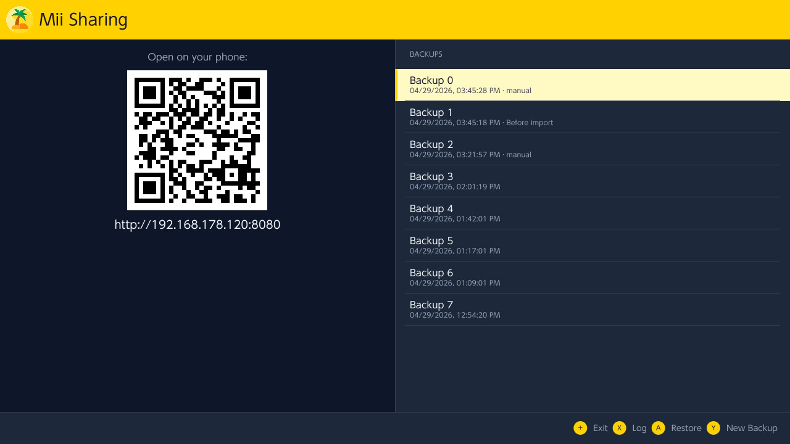
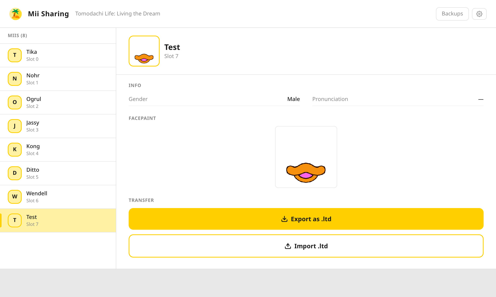
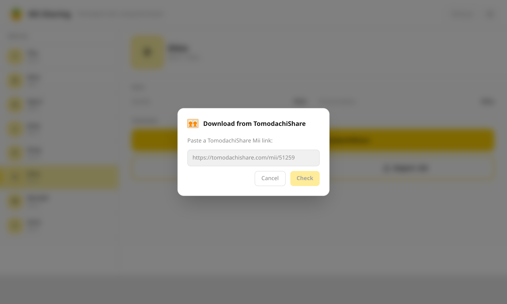
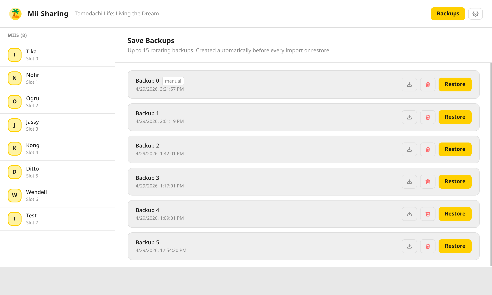

# Mii Sharing (beta) — Homebrew App 

Fan-made homebrew app for Nintendo Switch that lets you view, export, and import Miis in your Tomodachi Life: Living the Dream save data. Runs on top of [nx.js](https://github.com/TooTallNate/nx.js), a JavaScript runtime for Switch homebrew.

> [!WARNING]
> **Back up your save data before using this app.** This app reads and writes your Tomodachi Life: Living the Dream save file. Use [JKSV](https://github.com/J-D-K/JKSV) or another save manager to create a backup first. We are not responsible for any data loss.

## 🛋️ Motivation

Other awesome tools like [Azkun/ShareMii](https://github.com/Azkun/ShareMii) require dumping your save to a PC, editing it there, and re-uploading — a lot of steps just to add a friend's Mii. This app takes a different approach:

- **No PC needed** — runs directly on your homebrew Switch
- **Any browser** — your Switch serves the UI over local WiFi, use your phone or laptop
- **Direct TomodachiShare integration** — browse [tomodachishare.com](https://tomodachishare.com), paste a link, done
- **Couch-friendly** — Switch in the dock, phone in hand

> Need to edit your whole save file? [ShareMii](https://github.com/Azkun/ShareMii) has you covered.

## 📋 Requirements

- Nintendo Switch with homebrew enabled
- Tomodachi Life: Living the Dream

## 📸 Screenshots

## 🚀 Usage

**Deploy to Switch:**
Copy the resulting `.nro` to your Switch.

**Running:**

Once the app is launched on the Switch, it displays the Switch's local IP address. Open that address in a browser on any device on the same network (e.g. `http://192.168.1.x:8080`). Also supports mobile devices for easy side by side navigation.

**Exporting a Mii:**

Click a Mii in the list, then click "Export as .ltd". The browser downloads a `.ltd` file. You can then share that file with your friends.

**Importing a Mii:**

Click an occupied slot, then click "Import .ltd" and select a `.ltd` file from your device.

**Downloading from TomodachiShare:**

Find a Mii you like on [tomodachishare.com](https://tomodachishare.com), copy the link (e.g. `https://tomodachishare.com/mii/51259`), click **"Download from TomodachiShare"** in the app, paste the link and hit Import. No file download, no PC — the Mii goes straight into the selected slot.

## 🙏 Acknowledgements

- [Star-F0rce/ShareMii](https://github.com/Star-F0rce/ShareMii) — created the ltds file format that this app builds on.
- [Azkun/ShareMii](https://github.com/Azkun/ShareMii) — reference implementation for ltds and inspiration for the overall approach.
- [tomodachi-texture-tool](https://github.com/farbensplasch/tomodachi-texture-tool) by farbensplasch — MIT License. The NSW block-linear deswizzle algorithm used for facepaint canvas decoding was ported from this project.
- [nx.js](https://github.com/TooTallNate/nx.js) by TooTallNate — the JavaScript runtime this app is built on.
- [Tomodachi Share](https://tomodachishare.com) — community platform for sharing Miis. 

## 🤖 AI Disclosure

This project was built with AI assistance (Claude by Anthropic) acting as a development sparring partner — for additional code generation, code review, problem-solving, and discussion. All decisions, generated code and scripts were reviewed by a human.

## ⚖️ Legal

This is an unofficial fan project and is not affiliated with, endorsed by, or sponsored by Nintendo Co., Ltd. Tomodachi Life: Living the Dream and all related names, characters, and trademarks are the property of Nintendo Co., Ltd. All rights reserved.

This project does not distribute any game assets or proprietary data.
